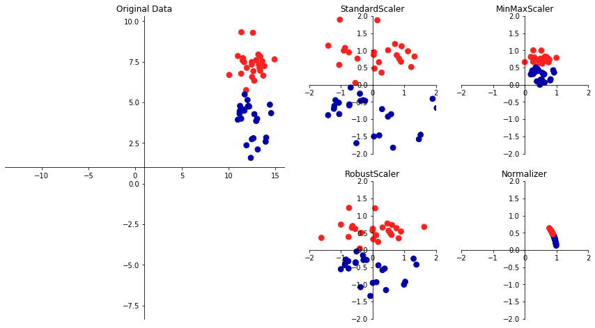

# 教師なし学習

## 教師なし学習の種類
- データセットの教師なし変換  
元のデータを変換して、人間や他の機械学習アルゴリズムにとってよりわかりやすい新しいデータ表現をつくること  
利用法としては次元削減が最も一般的  
次元削減とは多くの特徴量で構成されるデータの高次元表現を入力として、少量の本質的な特徴量でそのデータを表現する方法を見つけること 

- クラスタリング  
データを似たような要素から構成されるグループに分けるアルゴリズムのこと  
写真から全ての顔を抽出して似た顔でグループ分けする的な  
  
教師なし学習は学習結果の有用性の評価が難しい。なぜなら、ラベル情報がないから。学習機はグループ分けをしたとしてもそれが自分たちの求める形になってるか判断するのは結局人間。例えば写真に写っている人間を顔の大きさで別けてしまうなど。  
教師あり学習の前処理に使われることが多い。

## 前処理とスケール変換
アルゴリズムに適したデータ表現に変換することが重要  



上の画像はオリジナルデータを４つの前処理の方法で変換したものである。  

- StandardScaler  
個々の特徴量の平均が0で分散が1になるように変換して全ての特徴量の大きさを整えてくれる。
- RobustScaler  
中央値と四分位数を使って個々の特徴量が一定の範囲に入るように変換する。外れ値は無視される
- MInMaxScaler  
データがちょうど0から1の間に入るように変換する。
- Normalizer  
個々のデータポイントを特徴量ベクトルがユークリッド長1になるように変換する。

### データの変換
スケール変換などの前処理は、教師あり学習アルゴリズムを適用する前に用いる。MinMaxScalerを適用してみる。
```
from sklearn.datasets import  load_breast_cancer
from sklearn.model_selection import train_test_split
cancer = load_breast_cancer()

X_train,X_test,y_train,y_test = train_test_split(cancer.data,cancer.target,random_state=1)
print(X_train.shape)
print(X_test.shape)
```
出力は
```
(426, 30)
(143, 30)
```
　30の測定結果を表す569のデータポイントを426の訓練データと143のテストデータに分割した。  
クラスをインポートしてインスタンスを生成する。  
```
from sklearn.preprocessing import MinMaxScaler
scaler = MinMaxScaler()
```
fitメソッドを訓練データに対して適用して、スケール変換器を適合させる。fitメソッドは訓練データ中の各特徴量の最小値と最大値を計算する。X_trainデータのみを与えるのに注意。
```
#訓練データをスケール変換する
scaler.fit(X_train)
```
tansformメソッドで変換
```
#データを変換
X_train_scaled = scaler.transform(X_train)
#スケール変換の前後のデータ特性をプリント
print(X_train_scaled.shape)
print(X_train.min(axis=0))
print(X_train.max(axis=0))
print(X_train_scaled.min(axis=0))
print(X_train_scaled.max(axis=0))
```
出力
```
(426, 30)
[6.981e+00 9.710e+00 4.379e+01 1.435e+02 5.263e-02 1.938e-02 0.000e+00
 0.000e+00 1.060e-01 5.024e-02 1.153e-01 3.602e-01 7.570e-01 6.802e+00
 1.713e-03 2.252e-03 0.000e+00 0.000e+00 9.539e-03 8.948e-04 7.930e+00
 1.202e+01 5.041e+01 1.852e+02 7.117e-02 2.729e-02 0.000e+00 0.000e+00
 1.566e-01 5.521e-02]
[2.811e+01 3.928e+01 1.885e+02 2.501e+03 1.634e-01 2.867e-01 4.268e-01
 2.012e-01 3.040e-01 9.575e-02 2.873e+00 4.885e+00 2.198e+01 5.422e+02
 3.113e-02 1.354e-01 3.960e-01 5.279e-02 6.146e-02 2.984e-02 3.604e+01
 4.954e+01 2.512e+02 4.254e+03 2.226e-01 9.379e-01 1.170e+00 2.910e-01
 5.774e-01 1.486e-01]
[0. 0. 0. 0. 0. 0. 0. 0. 0. 0. 0. 0. 0. 0. 0. 0. 0. 0. 0. 0. 0. 0. 0. 0.
 0. 0. 0. 0. 0. 0.]
[1. 1. 1. 1. 1. 1. 1. 1. 1. 1. 1. 1. 1. 1. 1. 1. 1. 1. 1. 1. 1. 1. 1. 1.
 1. 1. 1. 1. 1. 1.]
 ```
 スケール変換された後は最大値最小値ともに変換されている。  
 同様にテストセットも変換しなきゃいけない。  
 ```
 #テストデータを変換
X_test_scaled = scaler.transform(X_test)
#スケール変換の前後のデータ特性をプリント
print(X_test_scaled.min(axis=0))
print(X_test_scaled.max(axis=0))
```
出力
```
[ 0.0336031   0.0226581   0.03144219  0.01141039  0.14128374  0.04406704
  0.          0.          0.1540404  -0.00615249 -0.00137796  0.00594501
  0.00430665  0.00079567  0.03919502  0.0112206   0.          0.
 -0.03191387  0.00664013  0.02660975  0.05810235  0.02031974  0.00943767
  0.1094235   0.02637792  0.          0.         -0.00023764 -0.00182032]
[0.9578778  0.81501522 0.95577362 0.89353128 0.81132075 1.21958701
 0.87956888 0.9333996  0.93232323 1.0371347  0.42669616 0.49765736
 0.44117231 0.28371044 0.48703131 0.73863671 0.76717172 0.62928585
 1.33685792 0.39057253 0.89612238 0.79317697 0.84859804 0.74488793
 0.9154725  1.13188961 1.07008547 0.92371134 1.20532319 1.63068851]
 ```
最小値と最大値が0と1になっていない。
これは訓練データに対する変換と同じ変換をしているから。
訓練データの最小値を引き、訓練データのレンジで割っている。

 ### 訓練データとテストデータを同じように変換する
 テストデータの最小値とレンジを使うとどうなるか
 ```
 from sklearn.datasets import make_blobs
#合成データを作成
X,_ = make_blobs(n_samples=50,centers=5,random_state=4,cluster_std=2)
#分割
X_train,X_test = train_test_split(X,random_state=5,test_size=.1)
#訓練セットとテストセットをプロット
fig,axes = plt.subplots(1,3,figsize=(13,4))
axes[0].scatter(X_train[:,0],X_train[:,1],c=mglearn.cm2(0),label="Training set",s=60)
axes[0].scatter(X_train[:,0],X_train[:,1],marker='^',c=mglearn.cm2(1),label="Test set",s=60)
axes[0].legend(loc='upper left')
axes[0].set_title("Original Data")

#MinMaxScalerでデータをスケール変換
scaler = MinMaxScaler()
scaler.fit(X_train)
X_train_scaled = scaler.transform(X_train)
X_test_scaled = scaler.transform(X_test)
#スケール変換されたデータの特性を可視化
axes[1].scatter(X_train_scaled[:,0],X_train_scaled[:,1],c=mglearn.cm2(0),label="Training set",s=60)
axes[1].scatter(X_test_scaled[:,0],X_test_scaled[:,1],marker='^',c=mglearn.cm2(1),label="Test set",s=60)
axes[1].set_title("Scaled Data")

#テストセットを訓練セットとは別にスケール変換
#最小値と最大値が0,1になる。ここでは説明のためにわざとやっている。実際はだめ
test_scaler = MinMaxScaler()
test_scaler.fit(X_test)
X_test_scaled_badly = test_scaler.transform(X_test)

#間違ってできたスケール変換されたデータを可視化
axes[2].scatter(X_train_scaled[:,0],X_train_scaled[:,1],c=mglearn.cm2(0),label="training set",s=60)
axes[2].scatter(X_test_scaled_badly[:,0],X_test_scaled_badly[:,1],marker='^',c=mglearn.cm2(1),label="test set",s=60)
axes[2].set_title("Improperly Scaled Data")

for ax in axes:
    ax.set_xlabel("Feature 0")
    ax.set_ylabel("Feature 1")
```


１つ目のグラフは変換されてない2次元データ、２つ目のグラフは同じ変換を施した2次元データ、３つ目は訓練とテストで別の変換を施したデータ。別の変換を施した場合、最大値と最小値が1と0になっている。これはやってはいけない。

### 教師あり学習における前処理の効果
SVCを訓練する。
```
from sklearn.svm import SVC

X_train,X_test,y_train,y_test = train_test_split(cancer.data,cancer.target,random_state=0)
svm = SVC(C=100)
svm.fit(X_train,y_train)
print(svm.score(X_test,y_test))
```
結果
0.9440559440559441
なんか精度が良くなってしまった。
```
#0-1スケール変換で前処理
scaler= MinMaxScaler()
scaler.fit(X_train)
X_train_scaled = scaler.transform(X_train)
X_test_scaled = scaler.transform(X_test)

#変換された訓練データで学習
svm.fit(X_train_scaled,y_train)

#変換されたテストセットデータでスコア計算
print(svm.score(X_test_scaled,y_test))
```
スケール変換後
0.965034965034965  
精度が上がった。
StandardScaler使ってみる。
クラスを変えるだけだから便利。
```
#平均を0に分散を1に前処理
from sklearn.preprocessing import StandardScaler
scaler = StandardScaler()
scaler.fit(X_train)
X_train_scaled = scaler.transform(X_train)
X_test_scaled = scaler.transform(X_test)

#変換された訓練データで学習
svm.fit(X_train,y_train)

#変換されたテストセットでスコア計算
print(svm.score(X_test_scaled,y_test))
```
出力結果
0.6293706293706294  
なんか精度落ちたおかしい。

## 次元削減、特徴量抽出、多様体学習
データ変換の動機には、可視化、データの圧縮、以降の処理に適した表現の発見にある。
これらに対して用いられるアルゴリズムは主成分分析(PCA),非負値行列因子分解(NMF)、t-SNEがある。

### 主成分分析(PCA)
データセットの特徴量を相互に統計的に関連しないように回転する手法。回転させたあとにデータの説明に必要な一部の特徴量だけを抜き出す。
```
mglearn.plots.plot_pca_illustration()
```


Component1が最も分散が大きい方向(情報が多いということ)で、第一成分というラベルを貼る。次に第一成分と直交する方向を探して、最も情報が多い方向を見つける。こうして見つかった方向が**主成分**と呼ばれる。特徴量と同じ数存在する。  

cancerデータセットのPCAによる可視化  
高次元のデータセットを可視化してみる。
2特徴量の組み合わせは数がえげつないので特徴量ごとに良性と悪性のヒストグラムを書く。  
```
from sklearn.datasets import  load_breast_cancer
cancer = load_breast_cancer()
fig,axes = plt.subplots(15,2,figsize=(10,20))
malignant = cancer.data[cancer.target == 0]
benign = cancer.data[cancer.target == 1]

ax = axes.ravel()

for i in range(30):
    _,bins = np.histogram(cancer.data[:,i],bins =50)
    ax[i].hist(malignant[:,i],bins=bins,color=mglearn.cm3(0),alpha=.5)
    ax[i].hist(benign[:,i],bins=bins,color=mglearn.cm3(2),alpha=.5)
    ax[i].set_title(cancer.feature_names[i])
    ax[i].set_yticks(())
    ax[0].set_xlabel("Feature magnitude")
    ax[0].set_ylabel("Frequency")
    ax[0].legend(["malignant","benign"],loc="best")
    fig.tight_layout()
```


どの特徴量が良性と悪性を見分けるのに役立ちそうかわかる。  
worst concave pointsはヒストグラムが別れているから情報が多い。  
次にPCAを適用する前にデータをStandardScalerでスケール変換して、個々の特徴量の分散が1になるようにする。
```
from sklearn.preprocessing import StandardScaler
scaler = StandardScaler()
scaler.fit(cancer.data)
X_scaled = scaler.transform(cancer.data)
```
PCAオブジェクトを生成して、fitメソッドを呼び出して主成分を見つけてtransformするだけ。  
維持する主成分の数を指定する必要がある。
```
#デフォルトだとすべての主成分を保持してしまうので維持する主成分を限定する
from sklearn.decomposition import PCA
#データの最初の主成分だけ維持
pca = PCA(n_components=2)
#cancerモデルにPCAモデルを適合
pca.fit(X_scaled)

#最初の2つの主成分に対してデータポイントを変換
X_pca = pca.transform(X_scaled)
print("Original shape: {}".format(X_scaled.shape))
print("Reduced shape: {}".format(X_pca.shape))
```
出力
```
Original shape: (569, 30)
Reduced shape: (569, 2)
```
最初の２つの主成分に対してプロットしてみる
```
#第一主成分と第二主成分によるプロット。クラスごとに色分け
plt.figure(figsize=(8,8))
mglearn.discrete_scatter(X_pca[:,0],X_pca[:,1],cancer.target)
plt.legend(cancer.target_names,loc="best")
plt.gca().set_aspect("equal")
plt.xlabel("First Principal component")
plt.ylabel("Second Principal component")
```


実際に次元削減してプロットするとこのような散布図になった。これで線形クラス分類器とかやったらうまく分類できそう。