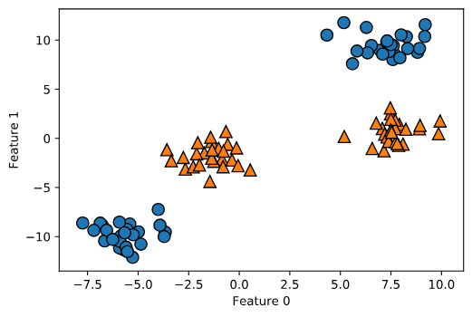
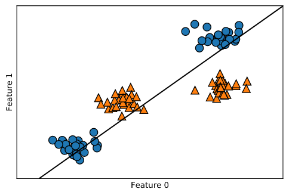
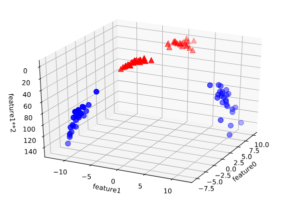
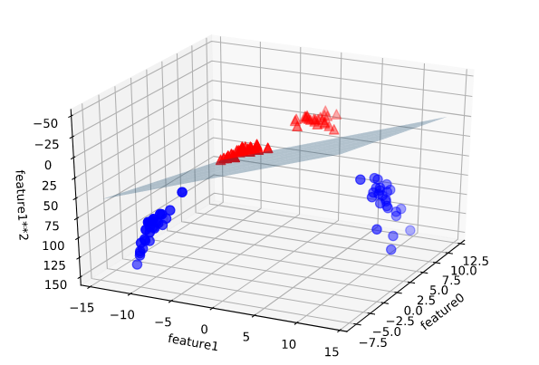
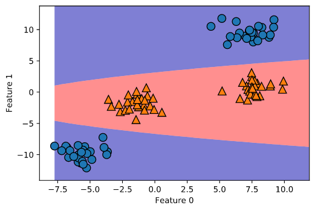
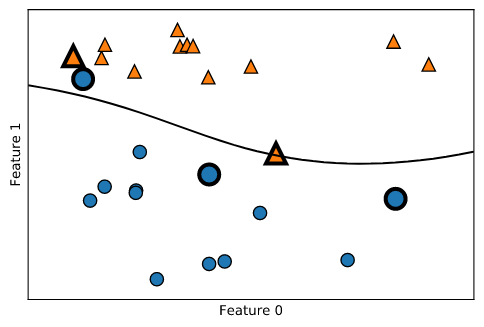
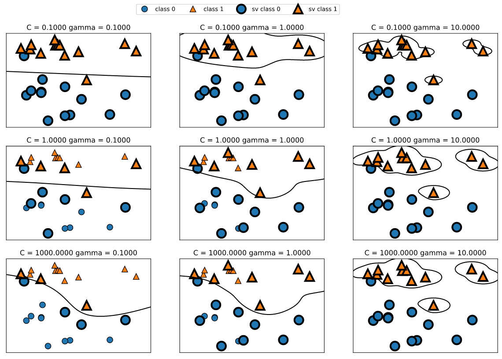

# 機械学習


## 最初にインポートする系
```python
from sklearn.datasets import load_iris
import numpy as np
import matplotlib.pyplot as plt
import pandas as pd
import mglearn
import scipy as sp
import sklearn
from sklearn.model_selection import train_test_split
%matplotlib inline
```
<br>

```
X,y = mglearn.datasets.make_forge()
```
これで色々データとってこれる  
make_~　以降で取ってくるデータを指定できる
<br>

```
discrete_scatter(X[:,0],X[:,1],y)
```
dicrete_scatter  
グラフ書く時に使うやつ  
第１引数： 散布図に描写する各データのX値  
第２引数： 散布図に描写する各データのY値  
第３引数： 散布図に描写する各データのラベル
<br>

```
plt.legend(["Class 0","Class 1"],loc=4)
```
凡例の指定とlocでどこの事象に凡例を示すか指定できる
<br>  
  
  
  
## 線形モデル
入力特徴量の線形関数を用いて予測を行うモデルのこと
  
### 線形モデルによる回帰
線形モデルによる一般的な予測式
```
y=w[0]x[0]+w[1]x[1]+・・・+w[p]x[p]+b
```


## 決定木のアンサンブル  

###  アンサンブル法
複数の機械学習モデルを組み合わせることによってより強力なモデルを構築する方法

### ランダムフォレスト
#### 概要
・決定木における訓練データの過剰適合を解決する手法の一つ。   
・複数の異なった方向に過剰適合した決定木を作り、その結果の平均値を取ることによって過剰適合の度合いを減らす。  
・データを復元抽出して複数のサンプルデータを作成(boostrap sample)
・特徴量のサブセットを用意して個々の決定木で学習
  
#### やり方
ランダムフォレストをインポート
```
from sklearn.ensemble import RandomForestClassifier
```
今回使用するデータセットをインポートして学習させる  
n_samplesでデータを100個復元抽出して作る  
n_estimatorsで決定木の個数を指定
```
from sklearn.datasets import make_moons
X,y = make_moons(n_samples=100,noise=0.25,random_state=3)
X_train,X_test,y_train,y_test = train_test_split(X,y,stratify=y,random_state=42)
forest = RandomForestClassifier(n_estimators=5,random_state=2)
forest.fit(X_train,y_train)
```
グラフに描画
```
fig,axes = plt.subplots(2,3,figsize=(20,10))
for i,(ax,tree) in enumerate(zip(axes.ravel(),forest.estimators_)):
    ax.set_title("Tree {}".format(i))
    mglearn.plots.plot_tree_partition(X_train,y_train,tree,ax=ax)
mglearn.plots.plot_2d_separator(forest,X_train,fill=True,ax=axes[-1,-1],alpha=.4)
axes[-1,-1].set_title("Random Forest")
mglearn.discrete_scatter(X_train[:,0],X_train[:,1],y_train)
```


  

## カーネル法を用いたサポートベクトルマシン

背景・・・線形モデルは制約が強い  
対策・・・特徴量を追加することで線形モデルを柔軟にする  
回帰 ◯ 分類 ×  
合成データセット
```
X,y = make_blobs(centers=4,random_state=8)
y = y%2
mglearn.discrete_scatter(X[:,0],X[:,1],y)
plt.xlabel("Feature 0")
plt.ylabel("Feature 1")
```

2クラスのデータセットを用意する。


これを直線で分類しようとすると

```
from sklearn.svm import LinearSVC
linear_svm = LinearSVC().fit(X,y)
mglearn.plots.plot_2d_separator(linear_svm,X)
mglearn.discrete_scatter(X[:,0],X[:,1],y)
plt.xlabel("Feature 0")
plt.ylabel("Feature 1")
```


となり直線で分類できない。

ここで入力特徴量を拡張するために feature1^^2の特徴量を追加する。  
これにより(feature 0,feature 1,feature1**2)の三次元空間に拡張する。

```
#2番目の特徴量の2乗を追加
X_new = np.hstack([X,X[:,1:]**2])
from mpl_toolkits.mplot3d import Axes3D,axes3d
figure = plt.figure()
#3Dで可視化
ax = Axes3D(figure,elev=-152,azim=-26)
#y==0の点をプロットしてからy==1の点をプロット
mask = y == 0
ax.scatter(X_new[mask,0],X_new[mask,1],X_new[mask,2],c='b',cmap=mglearn.cm2,s=60)
ax.scatter(X_new[~mask,0],X_new[~mask,1],X_new[~mask,2],c='r',marker='^',cmap=mglearn.cm2,s=60)
ax.set_xlabel("feature0")
ax.set_ylabel("feature1")
ax.set_zlabel("feature1**2")
```



こうして3次元に拡張することで、3次元空間内の平面で分離できる。

```
linear_svm_3d = LinearSVC().fit(X_new,y)
coef,intercept = linear_svm_3d.coef_.ravel(),linear_svm_3d.intercept_

#線形決定境界を描画
figure = plt.figure()
ax = Axes3D(figure,elev=-152,azim=-26)
xx = np.linspace(X_new[:,0].min(),X_new[:,0].max()+2,50)
yy = np.linspace(X_new[:,1].min()-2,X_new[:,1].max()+2,50)
XX,YY = np.meshgrid(xx,yy)
ZZ = (coef[0]*XX + coef[1]*YY + intercept)/-coef[2]
ax.plot_surface(XX,YY,ZZ,rstride=8,cstride=8,alpha=0.3)
ax.scatter(X_new[mask,0],X_new[mask,1],X_new[mask,2],c='b',cmap=mglearn.cm2,s=60)
ax.scatter(X_new[~mask,0],X_new[~mask,1],X_new[~mask,2],c='r',marker='^',cmap=mglearn.cm2,s=60)
ax.set_xlabel("feature0")
ax.set_ylabel("feature1")
ax.set_zlabel("feature1**2")
```



線形決定境界を描画できた。
これを元の特徴量の関数としてみると
```
ZZ=YY**2
dec = linear_svm_3d.decision_function(np.c_[XX.ravel(),YY.ravel(),ZZ.ravel()])
plt.contourf(XX,YY,dec.reshape(XX.shape),levels=[dec.min(),0,dec.max()],cmap=mglearn.cm2,alpha=0.5)
mglearn.discrete_scatter(X[:,0],X[:,1],y)
plt.xlabel("Feature 0")
plt.ylabel("Feature 1")
```



という楕円形になっている。

###カーネルトリック
<br>
しかしどの特徴量を加えたら良いかわからないという問題がある。
数学的なトリックとして特徴量のデータポイントを拡張せずに、直接データポイント間の距離を計算する方法としてカーネルトリックがある。

SVMは個々のデータポイントが2つのクラスの決定境界を表現するのにどの程度重要なのかを学習する。  
多くの場合、2つのクラスの境界に位置するごく一部の訓練データのみが決定境界を決定し、それらをサポートベクタと呼ぶ。  
サポートベクタとデータポイントとの距離が測定され、この距離とサポートベクタの重要性によって決定される。

データポイントとの距離を測る式(ガウシアンカーネル)  
krbf(x1,x2)=exp(-γ*abs(x1-x2)^2)

これを用いて決定境界を描画
```
from sklearn.svm import SVC
X,y = mglearn.tools.make_handcrafted_dataset()
svm = SVC(kernel='rbf',C=10,gamma=0.1).fit(X,y)
mglearn.plots.plot_2d_separator(svm,X,eps=.5)
mglearn.discrete_scatter(X[:,0],X[:,1],y)
#サポートベクタをプロットする
sv = svm.support_vectors_
#サポートベクタのクラスラベルはdual＿coef＿の正負によって与えられる
sv_labels = svm.dual_coef_.ravel() >0
mglearn.discrete_scatter(sv[0:,0],sv[:,1],sv_labels,s=15,markeredgewidth=3)
plt.xlabel("Feature 0")
plt.ylabel("Feature 1")
```

大きく縁取りされているのがサポートベクタ
Cとgammaの２つのパラメータを調整

###SVMのパラメータ調整
gammmaパラメータ→ガウシアンカーネルの幅を調整  
Cパラメータ→正則化パラメータ

パラメータ変化させるとどうなるか
```
fig,axes = plt.subplots(3,3,figsize=(15,10))

for ax,C in zip(axes,[-1,0,3]):
    for a,gamma in zip(ax,range(-1,2)):
        mglearn.plots.plot_svm(log_C=C,log_gamma=gamma,ax=a)

axes[0,0].legend(["class 0","class 1","sv class 0","sv class 1"],ncol=4,loc=(.9,1.2))
```


gammaが小さいとガウシアンカーネルの直径が短くなり多くの点を近いと判断する。大きくなると個々のデータポイントを重視するようになる。  
Cが小さいと正則化が強くなり汎化し、大きくなると正則化が弱くなり複雑化する。


